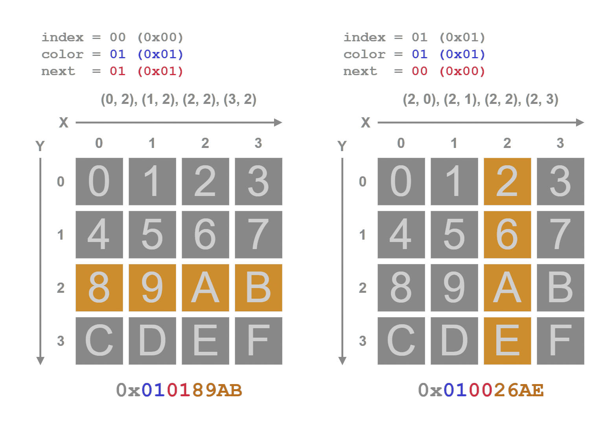
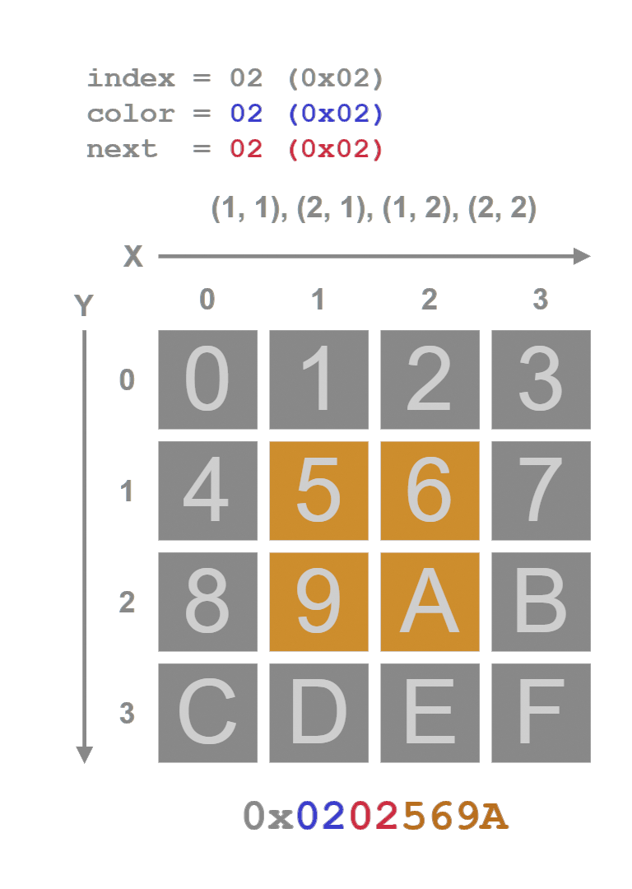
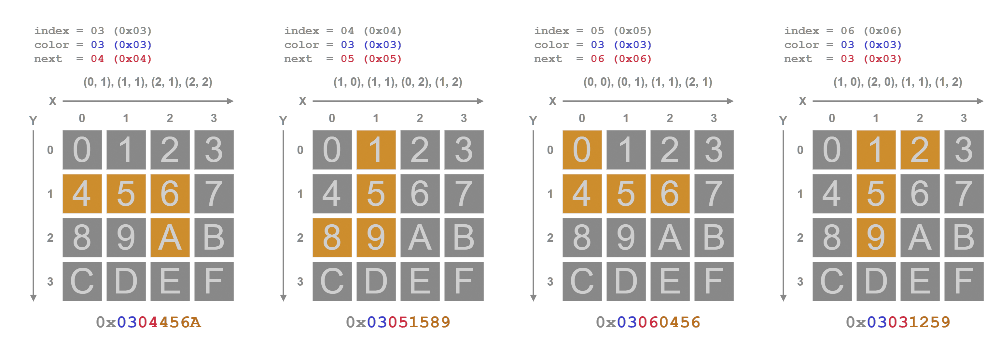
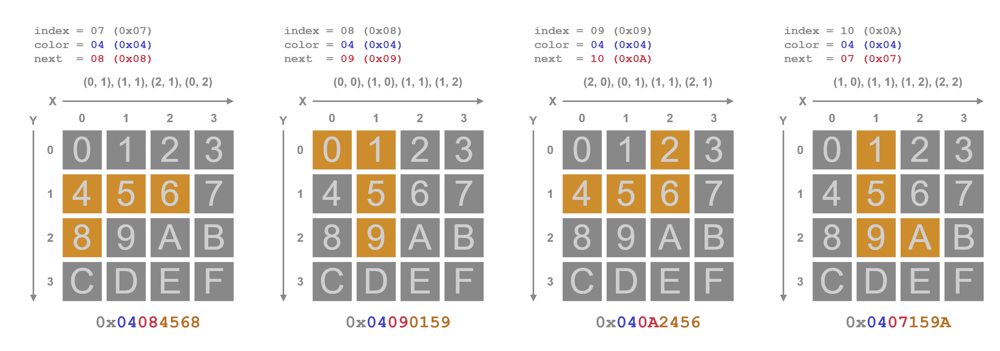
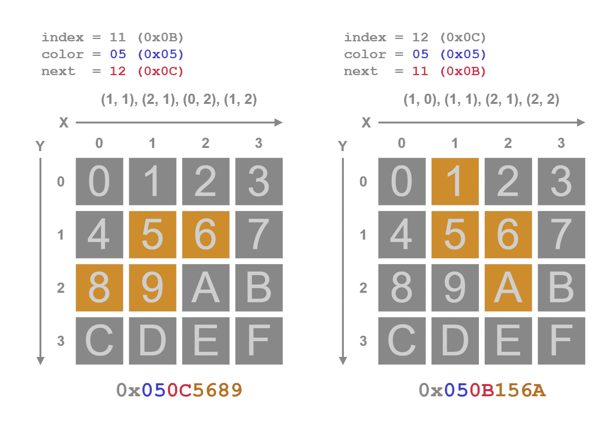
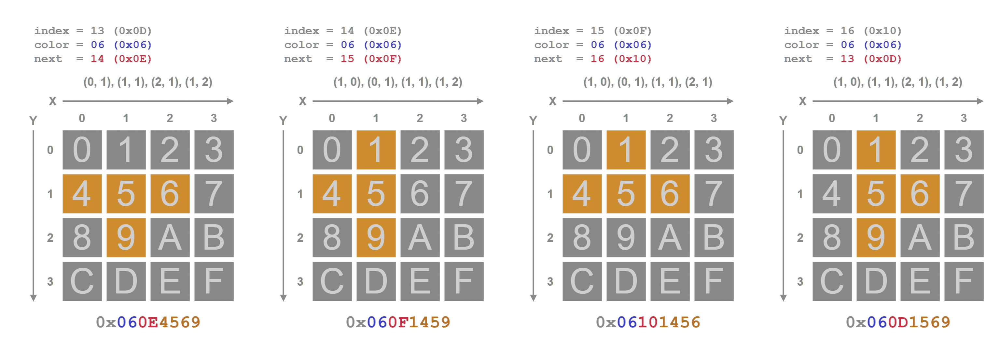
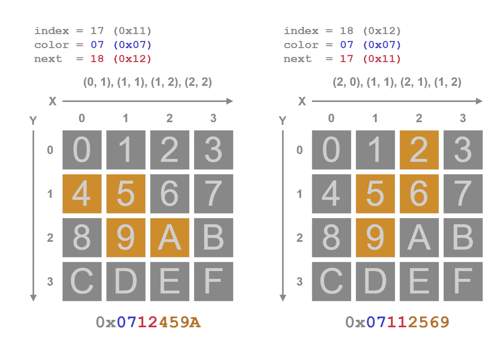

# Piece Properties
all pieces' properties are encoded into 32-bit unsigned integers, the properties being:
* Local (relative) coordinates of the four squares within each piece
* The index to the next piece for rotation
* The index to the color palette color (1 added)

Since the size of a piece (for both axes) can be at most 4, the coordinate values should be within the range ``0..3 (0b00..0b11)``
That means only 2 bits are needed to address them one each axes, or total 4 bits for both axes. In this implementation, the x and y values for a single square are encoded as ``y << 2 | x``, which results in the said 4-bit value.
The encoded coords for all four squares are placed sequentially, forming one 16-bit value (4 * 4 bits = 16 bits). This makes up the lower 16 bits of the 32-bit unsigned integer ``(bit range 0..16)``.

The ``bit range 16..24`` is used for storing the index to next piece that'll come when the current piece is "rotated". Please note that in this implementation, rotation isn't a property of a piece, rather a rotated piece is an independent piece by itself and a member of the piece look-up table. The index must be a valid index within this table. Although 8 bits are reserved for this, it shouldn't take more than 5 bits. Also, this implementation only supports rotation in one direction.

Lastly, the ``bit range 24..32`` is used for storing the index to the color in a palette, the value starts from 1. When indexing into the palette, this value must be subtracted by 1 to get the original index, as value 0 in the game code denotes an empty/null cell.

Below are the piece properties listed for each piece type. This is based on the NES right-handed rotation system.

## I-type:


## O-type:


## J-type:


## L-type:


## S-type:


## T-type:


## Z-type:


# Presence In Code
All the 32-bit unsigned integers are packed into an array in sequential order, which ultimately forms to look-up table that can be indexed easily. And is expected to consume only ``19 * 4 bytes = 76 bytes``.
All the values are precomputed and placed in the WASM module's data section, and will be loaded into memory during module initialization. Below is the C equivalent.

```c
const uint32_t TETRIS_PIECE_TABLE[19] = {
    0x010189ab,
    0x010026ae,
    0x0202569a,
    0x0304456a,
    0x03051589,
    0x03060456,
    0x03031259,
    0x04084568,
    0x04090159,
    0x040a2456,
    0x0407159a,
    0x050c5689,
    0x050b156a,
    0x060e4569,
    0x060f1459,
    0x06101456,
    0x060d1569,
    0x0712459a,
    0x07112569
};
```

For more info, please refer to the [pseudocode.c](pseudocode.c) file.